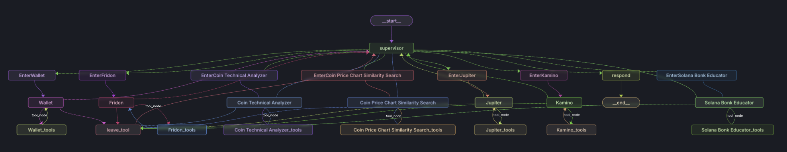

## What's FridonAI?

FridonAI is an open-source project dedicated to providing AI-powered tools and services for cryptocurrency analysis, blockchain operations, and more. Our mission is to simplify complex blockchain interactions and offer insightful analytics through an intuitive chat interface.
### Key Points

- **Products** 
  - **FridonAnalytics**: Analyze cryptocurrency prices, visualize data, emulate top traders' strategies, predict coin risks, recommend coins, and analyze protocol churn.
  - **FridonSearch**: Search for coins based on technical indicators, price chart similarity, and emulate trader-specific searches.
  - **FridonNotifier**: Set up custom alerts and notifications based on personalized indicators, or mimic the actions of top traders.
  - **FridonBlockchain**: Interact with blockchain operations effortlessly using simple text commands.
  - **FridonChat**: The core chat interface that unifies all functionalities under a single chat experience, where each capability is treated as a plugin.

- **Open-Source**
  - **Libraries**: Create your own crypto-focused chatbot using [fridon-core](/libs/core/), or leverage community-implemented tools available in [fridon-community](/libs/community/).
  - **End to End Application**: Except for the core chat functionality, the whole application is open-sourced. You can run your own instance of FridonAI and modify it according to your needs.
  - **Contribute**: Help diversify FridonAI's tools and capabilities through community contributions.

- **Platform**
  - **Empower Everyone**: Whether you are a user looking to utilize AI-driven tools or a developer looking to earn money from your custom tools, FridonAI makes it possible through its easy-to-use platform.


## How Does It Help?

- **Build Your Custom AI Chat**: Implement your own tools, and let [fridon-core](/libs/core/) manage everything else for your custom AI chatbot.

- **Use Implemented Crypto Tools**: Get access to powerful crypto tools or extend their capabilities by adding your custom features with [fridon-community](/libs/community/).

- **Chat to Unlock FridonAI's Potential**: Through the FridonAI platform, you can interact with all of FridonAI's capabilities effortlessly—just by chatting.


## Technical Overview

The FridonAI core is responsible for navigating user requests to relevant plugins, utilizing specific functionalities from each valid plugin. It facilitates easy plugin creation and supports connection with external systems using Redis. The core also generates a score for each chat interaction with users.

Key features:
- [Modular plugin architecture for easy extension](#plugin-structure-and-development)
- [Dynamic routing of requests to appropriate plugins](#put-everything-together)
- [Redis-based communication for external integrations](#application)
- [Scoring system for chat quality assessment](#scoring)

The core functionality of FridonAI is built with a modular architecture, allowing for easy integration and extension through plugins.


### What are Plugins?

Plugins in FridonAI are essentially LLM (Large Language Model) Agents that perform specific tasks using a set of Tools. Each plugin is designed to handle a particular domain or functionality.

- **Agents**: LLM-powered decision-makers that determine which Tools to use and in what order, based on the user's input and the task at hand.
- **Tools**: Functions that perform specific actions or retrieve information. They are wrappers around Utilities, adding functionality to make them compatible with LangChain's framework.
- **Utilities**: The underlying implementation of business logic and functionality that Tools utilize.


### Plugin Structure and Development

At [`libs/core/plugins`](libs/core/plugins), we've created an underlying structure of plugins, tools, and utilities to simplify plugin development. This structure allows users to extend base classes and implement only the business logic as utilities, while correctly setting parameters such as plugin name, utility description, examples, and so on.

The hierarchy is as follows:

1. **Plugins**: Extend [`BasePlugin`](libs/core/plugins/base.py)
2. **Tools**: Extend [`BaseTool`](libs/core/plugins/tools/base.py)
3. **Utilities**: Extend [`BaseUtility`](libs/core/plugins/utilities/base.py)

Developers can refer to the existing plugins in the [`libs/community/plugins/`](libs/community/plugins/) directory for examples of how to implement new plugins.

There are several `BaseUtility` extensions available, which can be used depending on the utility's specific requirements:

- [`BlockchainUtility`](libs/core/plugins/utilities/blockchain.py): For blockchain-related operations
- [`RemoteUtility`](libs/core/plugins/utilities/remote.py): For making remote API calls
- [`LLMUtility`](libs/core/plugins/utilities/llm.py): For language model interactions

By leveraging this structure, developers can focus on implementing the core functionality of their plugins without worrying about the underlying architecture.
[Plugins docs](/libs/core/fridonai_core/plugins/README.md).

### Put everything together

- **Graph**: Manages the conversation flow and agent interactions. Defined in [`libs/core/graph/`](libs/core/graph/), it uses LLM models to process user messages and delegate tasks to appropriate plugins. The Graph component is responsible for:
  - Dynamically building a network of LLM Agents, most of which are Plugins under the hood
  - Routing messages between agents
  - Managing states between agents
  - Creating chains with prompts and models
  - Parsing outputs
  - Automatically composing independently implemented plugins

  The Graph utilizes `LangGraph` (from LangChain) for graph structure and flow management, and `LangChain` for chains, prompts, formatting, and other language model interactions. This architecture allows for a flexible and scalable system that can easily incorporate new plugins and functionalities.



### Application

- The application uses Redis extensively for message handling and communication:
  - Receiving messages from clients
  - Sending responses back to clients
  - Publishing updates and notifications
  - Inter-service communication

- You can see controller logic in `apps/fridon_brain/main.py` and service layer in `apps/fridon_brain/services`

- [Nest.js application](apps/fridon_backend/) serves as the primary backend for the entire system. It facilitates communication between the front-end and Fridon Brain using Redis. Additionally, it implements various auxiliary functions, including: blockchain transaction generation, signing, sending, waiting for confirmation and so on.


### Scoring

FridonAI implements a scoring system to incentivize user engagement and provide feedback on the quality of interactions. Here's how it works:

- After each user question or command is processed and answered, the system assesses the dialogue.
- The assessment focuses primarily on the latest question and answer pair.
- A score is generated based on this assessment, which reflects the quality and effectiveness of the interaction.
- This score is then sent to the API repository (separate from this core repository).
- The API stores the score and notifies the user of their earned points.

The exact scoring criteria and implementation details can be found in the relevant scoring module within the codebase. [Scoring Module](libs/internals/scoring)


## Getting Started


**Use fridon-core as a library**
```bash
pip install fridonai-core
```
[fridonai-core documentation](libs/core/README.md)


**Run the whole project with Docker Compose**

```bash
docker compose up --build
```

**Set up the FridonAI Brain locally**

*It will need Redis and Postgres to be runnning and configured in .env*
1. **Clone the Repository**

   ```bash
   git clone https://github.com/FridonAI/fridon-ai.git
   ```

2. **Install Dependencies**

   ```bash
   poetry lock --no-update
   poetry install --no-root
   ```

3. **Set Up Environment Variables**

   Create a `.env` file in the `apps/fridon_brain` directory and add the necessary variables as defined in [`settings.py`](settings.py) or in [`.env.example`](apps/fridon_brain/.env.example)

4. **Run the Application**

   ```bash
   poetry run python -u -m apps.fridon_brain.main
   ```


## Contribution

We welcome contributions from the community. Developers can create new plugins or improve existing ones to enhance FridonAI's capabilities.

## License

This project is open-source and available under the [MIT License](LICENSE).


## Stay Connected

Follow us on Twitter for the latest updates and announcements:

[](https://x.com/Fridon_AI)

---

*Note: For more detailed information, please refer to the codebase and inline documentation.*